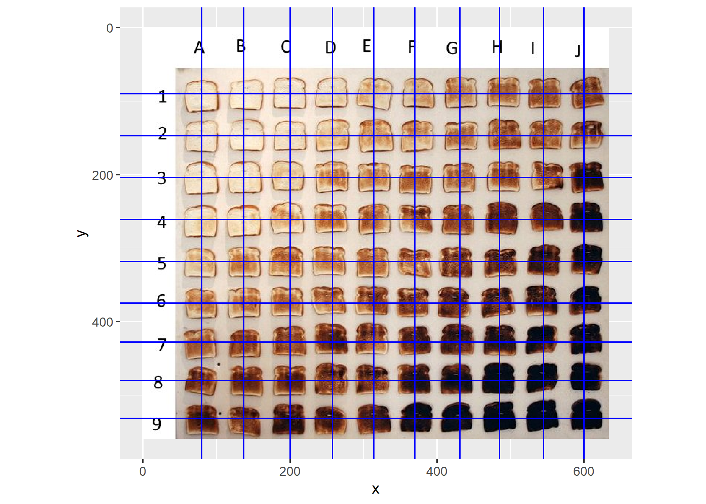
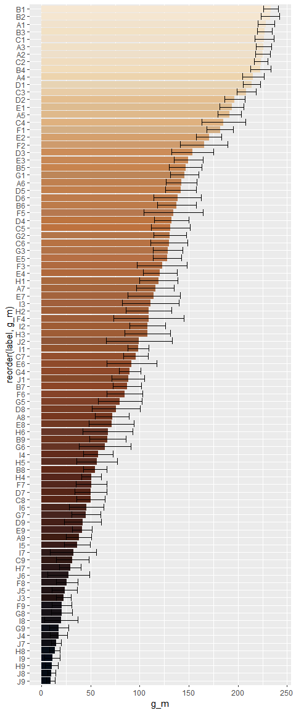
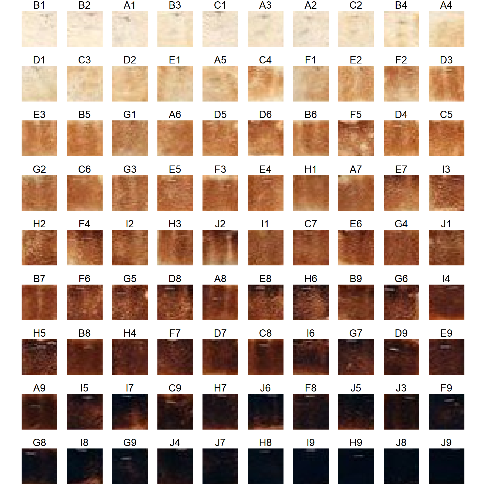

<!-- README.md is generated from README.Rmd. Please edit that file -->

# toast

-   After seeing [this viral
    tweet](https://twitter.com/oGarfield_/status/1519734049400668161?s=20&t=3-m52PNLVBIeSJvJZdeKgg)
    about the best way ‘to toast a toast’, I thought I’d have a go at
    some analysis to order each piece of toast in the image from least
    to most toasted.

``` r
library(tidyverse)
library(magick)
```

-   Start by reading the raw toast image
-   Then convert it to a dataframe with values of red, green and blue
    for each pixel

``` r
raw <- image_read('FRcuEGaXEAEgxCp.jfif')
i_raster <- raw %>% image_raster() %>% mutate(col2rgb(col) %>% t() %>% as_tibble()) %>% as_tibble()
```

-   Manually pick x and y values that will get me somewhere near the
    center of each piece of toast
-   I’m using the fact that the pieces of toast are roughly on a uniform
    grid to allow me to choose only 10 x-values and 9 y-values
    -   I’m doing it this way because I’m lazy
    -   It would be better to manually (or otherwise) get the 90
        coordinate pairs that land in the center of each piece of toast
-   Then visualise the x and y values to see if they are sensible

``` r
xs <- c(80, 137, 200, 258, 314, 370, 431, 485, 545, 600)
ys <- c(90, 147, 204, 261, 318, 375, 428, 480, 532)

i_raster %>% 
  ggplot()+
  geom_raster(aes(x,y,fill=I(col)))+
  geom_hline(yintercept = ys, col=4)+
  geom_vline(xintercept = xs, col=4)+
  coord_equal()+
  scale_y_reverse()
```

<!-- -->

-   Generate the labels for each piece of toast and define the width `w`
    and height `h` of the selection box to apply to each piece of toast
    -   Width and height needs to be an odd number here

``` r
labels <- crossing(column = LETTERS[1:10], row = 1:9) %>% mutate(label = paste0(column, row))
w <- 23
h <- 23
```

-   Now generate a dataframe of the 90 center coordinate pairs
-   Bind the center coordinates to their labels
-   Generate the coordinates of all pixels inside a box of width `w` and
    height `h` centered on each of the center coordinates
-   Inner join to the raster image dataframe to get the pixel colours at
    each coordinate contained within each selection box
-   Create a greyscale intensity column from the red, green and blue
    values of each pixel
    -   I did this using the weights sugegsted in [this stack overflow
        post](https://stackoverflow.com/questions/687261/converting-rgb-to-grayscale-intensity)
    -   I’m not sure if this is the best or even correct way of doing
        this
-   Add some normalised coordinates so each box can be plotted on the
    same coordinates
-   **And just wow…at how good the tidyverse is**

``` r
d <-
  crossing(x_c = xs, y_c = ys) %>%
  bind_cols(labels) %>% 
  mutate(tmp = map2(x_c, y_c, ~crossing(x = (.x - (w-1)/2):(.x + (w-1)/2),
                                        y = (.y - (h-1)/2):(.y + (h-1)/2)))) %>% 
  unnest(tmp) %>% 
  inner_join(i_raster, by = c("x", "y")) %>% 
  mutate(g = (0.2989 * red) + (0.5870 * green) + (0.1140 * blue)) %>% 
  group_by(label) %>% 
  mutate(x_norm = scales::rescale(x, c(1, w)), 
         y_norm = scales::rescale(y, c(1, h))) %>% 
  ungroup()
```

-   Visualise the selection boxes to check that they are sensible and
    visualise the selection of pixels within each box

``` r
ggplot()+
  geom_raster(data = i_raster, aes(x, y, fill = I(col)))+
  geom_rect(data = 
              d %>% 
              group_by(label) %>% 
              summarise(xs = min(x), xe = max(x), 
                        ys = min(y), ye = max(y),
                        .groups = "drop"),
            aes(xmin = xs, xmax = xe, ymin = ys, ymax = ye),
            col = 4, fill = NA)+
  coord_equal()+
  scale_y_reverse()+
  theme_void()

d %>% 
  ggplot() + 
  geom_raster(aes(x_norm, y_norm, fill = I(col)))+
  facet_grid(row~column)+
  coord_equal()+
  scale_y_reverse()+
  theme_void()
```


-   Aggregate the pixels in each selection box
-   Compute the mean and standard deviation of the red, green, blue and
    greyscale values

``` r
agg <- 
  d %>% 
  group_by(column, row, x_c, y_c, label) %>% 
  summarise(across(red:g, list(m = mean, sd = sd)), .groups = "drop")
```

-   Visualise the mean and standard deviation as a grid

``` r
agg %>% 
  ggplot()+
  geom_raster(aes(column, row, fill = g_m))+
  scale_fill_viridis_c(option = "plasma")+
  coord_equal()+
  scale_y_reverse(breaks = 1:9)+
  labs(title = "Intensity", x="", y="")+
  theme(legend.position = "bottom")

agg %>% 
  ggplot()+
  geom_raster(aes(column, row, fill = g_sd))+
  scale_fill_viridis_c(option = "plasma")+
  coord_equal()+
  scale_y_reverse(breaks = 1:9)+
  labs(title = "Standard deviation", x="", y="")+
  theme(legend.position = "bottom")
```


-   Visualise the mean and standard deviation as an ordered bar chart
-   Compute the colour of each aggregated selection box from the mean
    red, mean green and mean blue values
    -   Fill the bars with this colour

``` r
agg %>% 
  mutate(col_m = rgb(red_m, green_m, blue_m, maxColorValue = 255)) %>% 
  ggplot() + 
  geom_col(aes(reorder(label, g_m), g_m, fill=I(col_m))) + 
  geom_errorbar(aes(x = label, ymin = g_m - g_sd, ymax = g_m + g_sd))+
  coord_flip()
```

<!-- -->

-   Compute the order of the labels and visualise the selection boxes in
    order

``` r
toast_order <- agg %>% arrange(desc(g_m)) %>% pull(label)

d %>% 
  mutate(label = factor(label, levels = toast_order)) %>% 
  ggplot() + 
  geom_raster(aes(x_norm, y_norm, fill = I(col)))+
  facet_wrap(~label)+
  scale_y_reverse()+
  coord_equal()+
  theme_void()
```

<!-- -->
